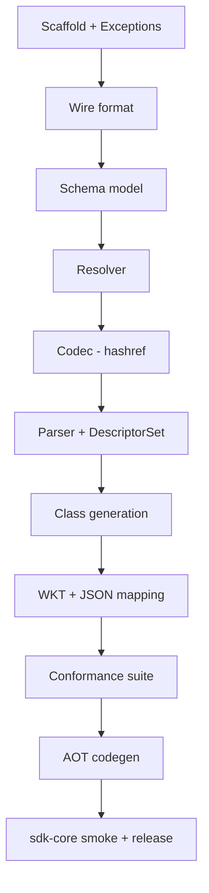

# Proto3 — Implementation Plan

A test-driven, incremental roadmap for building `Proto3`, a pure-Perl proto3
implementation, from `spec.md`. Each step is a self-contained prompt for a
code-generation LLM (consumed by `/bpe:execute-plan`). Steps follow strict
RED → GREEN → REFACTOR and build on each other with no orphaned code.

The design layers bottom-up so every step has a tested foundation beneath it:



---

## Current Status

Legend: ⬜ not started · 🟡 in progress · ✅ complete

| Phase | Steps | Status |
|---|---|---|
| 0 — Scaffold + Wire | 1–5 | ⬜ |
| 1 — Schema model + Resolver | 6–9 | ⬜ |
| 2 — Codec (hashref) | 10–15 | ⬜ |
| 3 — Parser + DescriptorSet | 16–22 | ⬜ |
| 4 — Class generation | 23–25 | ⬜ |
| 5 — WKT + JSON mapping | 26–29 | ⬜ |
| 6 — Conformance suite | 30–31 | ⬜ |
| 7 — AOT codegen | 32 | ⬜ |
| 8 — sdk-core smoke + release | 33 | ⬜ |

Detailed sub-step tracking lives in `todo.md`.

---

## Conventions for every step

- **Perl:** 5.38+, `use v5.38; use experimental 'class';` (or core `feature
  'class'` where stable). Pure Perl — zero XS required to install.
- **Test framework:** `Test2::V1`. Canonical preamble in every test file:

  ```perl
  use v5.38;
  use strict;
  use warnings;
  use utf8;
  use Test2::V1;
  ```

- **File header:** every `.pm`/`.t` starts with a 2-line comment; first line
  begins `ABOUTME: ` (grep-friendly).
- **Tests assert OUR logic**, never framework/language behavior. No
  "Math::BigInt can add" tests.
- **`just check`** runs the full local gate (lint + `dzil test` / `prove`).
  Defined in Step 1; every step ends by running it.
- **Exceptions:** raise typed `Proto3::Exception::*`, never bare `die "string"`
  in library code, after Step 2 lands.

---

## Step 1: Project scaffold and build system

**NOTE**: Greenfield repo containing only `spec.md`. This step creates the
distribution skeleton and the `just check` gate everything else relies on.

```text
1. RED: Write the smoke test first:
   - Create t/00-load.t:
     - Test that `Proto3` loads (use_ok 'Proto3')
     - Test that Proto3->VERSION returns a defined, non-empty version string
   This test fails because lib/Proto3.pm does not exist yet.

2. GREEN: Create the minimal distribution to pass:
   - Create lib/Proto3.pm:
     - ABOUTME header (2 lines)
     - package Proto3; our $VERSION = '0.001'; a short POD synopsis stub
   - Create dist.ini using the [@Starter::Git] bundle, min Perl 5.38,
     name = Proto3, license = MIT, author + copyright.
   - Create cpanfile listing runtime deps (JSON::PP, Math::BigInt,
     File::ShareDir, Syntax::Keyword::Try) and test deps (Test2::Suite).
   - Create the directory tree from spec §2: lib/Proto3/, lib/Proto3/Wire/,
     Schema/, Parser/, WKT/, Class/, DescriptorSet/, plus t/ subdirs
     (unit/ wire/ parser/ resolver/ codec/ wkt/ json/ descriptor/
     codegen/ conformance/) and share/proto/google/protobuf/.
     Use .gitkeep in empty dirs.

3. Create the local task runner:
   - Create justfile with targets:
     - `check`: run perlcritic (gentle) + `prove -lr t` (and `dzil test`
       when dzil is available)
     - `test`: `prove -lr t`
     - `lint`: perlcritic on lib/ bin/
   - Add commit-msg.md to .gitignore (per git workflow), plus typical Perl
     ignores (.build/, Proto3-*/, MYMETA.*, blib/).

4. Create CI skeleton:
   - Create .github/workflows/ci.yml matching spec §6: matrix over
     ubuntu-22.04/24.04 + macos, Perl 5.38/5.40/5.42, installs
     protobuf-compiler + libprotoc-dev, runs `dzil test`. Mark
     protoc-dependent stages as present but allow graceful skip.

5. GREEN: Confirm t/00-load.t passes.

6. Document: Add a short README.md stub (name, one-line purpose, status:
   pre-alpha, pointer to spec.md).

7. Verify: run `just check` — load test green, lint clean.
```

---

## Step 2: Exception hierarchy

**NOTE**: All later code raises these. Build the full tree now so nothing
back-fills bare `die`. Spec §4.10.

```text
1. RED: Write exception tests first:
   - Create t/unit/exception.t:
     - Test Proto3::Exception::Argument->throw(message => 'foo') is caught by
       eval and the caught object's ->message eq 'foo'  (T-exc-1)
     - Test stringification: "$err" interpolates to the message  (T-exc-2)
     - Test isa hierarchy: a Proto3::Exception::Wire::Truncated object
       ->isa('Proto3::Exception::Wire') and ->isa('Proto3::Exception')  (T-exc-3)
     - Test ->cause is undef by default and round-trips when passed
     - Test that throw() actually dies (lives_ok / dies_ok semantics)

2. GREEN: Write minimal code to pass:
   - Create lib/Proto3/Exception.pm:
     - class Proto3::Exception with field $message :param :reader and
       field $cause :param :reader = undef
     - method throw(%fields) { die $class->new(%fields) }
     - use overload q{""} => sub { $_[0]->message }, fallback => 1
   - Create subclasses, each `:isa(Proto3::Exception)`, in their own files
     under lib/Proto3/Exception/ (or grouped per spec — match spec §4.10):
       Argument; Wire + Wire::Truncated, Wire::VarintTooLong,
       Wire::DeprecatedGroup; Schema + Schema::UnresolvedType,
       Schema::DuplicateField, Schema::DuplicateMessage; Parser +
       Parser::ImportNotFound, Parser::ImportCycle, Parser::UnsupportedSyntax;
       Codec + Codec::UnknownType, Codec::TypeMismatch; JSON + JSON::Parse,
       JSON::WKT.

3. REFACTOR: Ensure overload/throw live only on the base and are inherited;
   no duplication across subclasses.

4. Document: Add POD to Proto3::Exception listing the full hierarchy and the
   throw/stringify contract.

5. Verify: run `just check`.
```

---

## Step 3: Varint and zigzag (`Proto3::Wire::Varint`)

**NOTE**: The numeric core of the wire format. 32-bit-Perl fallback via
Math::BigInt is OUR logic and must be tested. Spec §4.1.

```text
1. RED: Write varint/zigzag tests first:
   - Create t/wire/varint.t:
     - encode_varint then decode_varint round-trips for 0, 1, 127, 128,
       16383, 16384, 2**32, 2**63, 2**64-1  (T-wire-1)
     - decode_varint returns (value, remaining-bytes) and consumes only the
       varint, leaving trailing bytes intact
     - zigzag round-trip for -1, 0, 1, -2147483648, 2147483647, -2**63,
       2**63-1 (encode_zigzag32/64 + decode_zigzag32/64)  (T-wire-2)
     - Truncated varint (high-bit-set final byte) raises
       Proto3::Exception::Wire::Truncated  (T-wire-4)
     - 11-byte varint (no terminator within 10) raises
       Proto3::Exception::Wire::VarintTooLong  (T-wire-5)
     - Negative value to encode_varint raises Proto3::Exception::Argument
     - Known-vector check: encode_varint(300) eq "\xac\x02"

2. GREEN: Write minimal code:
   - Create lib/Proto3/Wire/Varint.pm exporting encode_varint, decode_varint,
     encode_zigzag32, decode_zigzag32, encode_zigzag64, decode_zigzag64.
     - LSB-first 7-bit groups + continuation bit.
     - zigzag: (n << 1) ^ (n >> 31|63) encode; (n >> 1) ^ -(n & 1) decode.
     - Detect $Config{ivsize} == 4 and use Math::BigInt for 64-bit math when
       native ints are too narrow.

3. RED: Add 32-bit-path tests:
   - Add to t/wire/varint.t a section forcing the Math::BigInt path (e.g.
     guarded by a constructor flag or an internal helper that accepts a
     "force bigint" mode) and assert identical bytes to the native path for
     2**63 and 2**64-1.  (T-wire-7)

4. GREEN: Implement the forced-bigint code path the test drives.

5. REFACTOR: Extract shared group-emit/group-consume helpers; keep public
   subs thin.

6. Document: POD for each exported sub with the formulas and byte limits.

7. Verify: run `just check`.
```

---

## Step 4: Tag packing (`Proto3::Wire::Tag`)

**NOTE**: Builds directly on Step 3's varint. Spec §4.1.

```text
1. RED: Write tag tests first:
   - Create t/wire/tag.t:
     - encode_tag(1, WIRE_VARINT) eq "\x08"; encode_tag(2, WIRE_LEN) eq "\x12"
       (T-wire-3)
     - decode_tag returns (field_number, wire_type, rest)
     - Round-trip arbitrary field numbers across the legal range incl. max
       536870911 and a sampling of mid values  (T-wire-3)
     - decode_tag on a tag carrying wire type 3 (SGROUP) raises
       Proto3::Exception::Wire::DeprecatedGroup; same for 4 (EGROUP)
       (T-wire-6)
     - Field number 0 in encode_tag raises Proto3::Exception::Argument

2. GREEN: Write minimal code:
   - Create lib/Proto3/Wire/Tag.pm exporting encode_tag, decode_tag and the
     wire-type constants WIRE_VARINT=0, WIRE_I64=1, WIRE_LEN=2, WIRE_I32=5.
     - encode_tag: varint(($field << 3) | $wire); decode_tag reverses and
       rejects wire types 3 and 4.

3. REFACTOR: Reuse Varint encode/decode; no re-implementation.

4. Document: POD listing the wire-type table from spec §4.1.

5. Verify: run `just check`.
```

---

## Step 5: Wire facade — fixed-width, float, fuzz (`Proto3::Wire`)

**NOTE**: Ties Varint + Tag together and adds fixed32/64 + float/double. After
this, the whole wire layer is complete and fuzz-hardened. Spec §4.1.

```text
1. RED: Write fixed-width and float tests first:
   - Create t/wire/fixed.t:
     - encode_fixed32/decode_fixed32 little-endian round-trip (incl. 0,
       0xFFFFFFFF) using known byte vectors
     - encode_fixed64/decode_fixed64 little-endian round-trip
     - encode_float/decode_float and encode_double/decode_double round-trip
       representative values
     - Float/double NaN, +Inf, -Inf round-trip (compare via unpack, not ==)
       (T-wire-8)
   - Create t/wire/fuzz.t:
     - Feed 10000 deterministic pseudo-random byte strings (seeded, fixed
       seed for reproducibility) to a top-level decode-tag-then-skip loop;
       each must either decode or raise a Proto3::Exception::Wire subclass —
       never an untyped die, never silent misparse  (T-wire-9)

2. GREEN: Write minimal code:
   - Create lib/Proto3/Wire.pm:
     - Re-export the Varint + Tag public API (single import surface per
       spec §4.1 SYNOPSIS).
     - Add encode_fixed32/decode_fixed32 (pack 'V'),
       encode_fixed64/decode_fixed64 (pack 'Q<' with Math::BigInt fallback
       on 32-bit), encode_float/decode_float (pack 'f<'),
       encode_double/decode_double (pack 'd<').

3. REFACTOR: Centralize the 32-bit fixed64 fallback with Step 3's helper.

4. Document: Complete Proto3::Wire POD with the full public API and the
   wire-type table.

5. Verify: run `just check`. Phase 0 complete — wire layer solid.
```

---

## Step 6: Schema element classes (`Proto3::Schema::*`)

**NOTE**: Pure data classes with construction-time invariants. Spec §4.2.
Test only OUR invariants (duplicate detection, derived predicates), not that
`field` stores a value.

```text
1. RED: Write schema-object tests first:
   - Create t/unit/schema_objects.t:
     - Construct Schema::Message with two Schema::Field; readers return
       expected name/full_name/fields  (T-schema-1)
     - Construct Schema::Message with duplicate field NUMBER raises
       Proto3::Exception::Schema::DuplicateField  (T-schema-2)
     - Construct Schema::Message with duplicate field NAME raises
       Proto3::Exception::Schema::DuplicateField
     - Field predicates: is_message/is_enum/is_repeated/is_map return correct
       booleans for representative fields
     - is_packed true only when packed && repeated && packable scalar; false
       for repeated message and for repeated string
     - Enum with allow_alias=0 and duplicate value numbers raises; with
       allow_alias=1 it constructs

2. GREEN: Write minimal code (one file each, spec §4.2 signatures):
   - lib/Proto3/Schema/Field.pm (with is_message/is_enum/is_repeated/is_map/
     is_packed + private _is_packable_scalar)
   - lib/Proto3/Schema/Oneof.pm
   - lib/Proto3/Schema/Enum.pm (allow_alias validation)
   - lib/Proto3/Schema/Message.pm (duplicate field number/name validation in
     constructor)
   - lib/Proto3/Schema/Service.pm
   - lib/Proto3/Schema/File.pm

3. REFACTOR: Share the duplicate-detection helper if used in more than one
   class.

4. Document: POD per class listing fields and invariants.

5. Verify: run `just check`.
```

---

## Step 7: Schema facade and index (`Proto3::Schema`)

**NOTE**: Registry + fully-qualified-name index that the resolver consumes.
Spec §4.2 facade.

```text
1. RED: Write facade tests first:
   - Create t/unit/schema_facade.t:
     - add_file then files/file('name') round-trip
     - message('fq.name')/enum('fq.name') look up by fully-qualified name,
       including nested types (Outer.Inner)
     - all_messages/all_enums flatten nested definitions
     - add_file with a type whose full_name duplicates an already-registered
       type raises Proto3::Exception::Schema::DuplicateMessage  (spec §4.2
       failure modes)
     - Unknown name lookups return undef (not die)

2. GREEN: Write minimal code:
   - Create lib/Proto3/Schema.pm:
     - class with add_file, files, file, message, enum, service,
       all_messages, all_enums.
     - Build a fq-name -> object index on add_file; walk nested messages/enums
       recursively to populate it; detect duplicates there.
     - resolve method declared as a stub that delegates (filled in Step 9).

3. REFACTOR: Make index-building a single recursive walker reused by
   all_messages/all_enums.

4. Document: POD for the facade API.

5. Verify: run `just check`.
```

---

## Step 8: Type resolver (`Proto3::Resolver`)

**NOTE**: THE component GPB::Dynamic gets wrong (spec §0.1, §4.3). The scoping
rules are the heart of the project. Differential test against protoc deferred
to Step 22 (needs the parser/FDS to build the sdk-core graph); the unit
scoping tests here are exhaustive.

```text
1. RED: Write resolver scoping tests first:
   - Create t/resolver/scoping.t (build small Schema fixtures by hand):
     - Fully-qualified '.foo.bar.Baz' from any current_package resolves
       directly to that type  (T-res-1)
     - Relative 'common.X' from package 'coresdk.workflow_activation' with
       'coresdk.common.X' defined resolves to coresdk.common.X  (T-res-2)
     - Same relative ref with ONLY root 'common.X' defined resolves to root
       (T-res-3)
     - Both 'coresdk.common.X' and root 'common.X' defined -> innermost
       (coresdk.common.X) wins  (T-res-4)
     - Nested-message scope: ref 'Bar' inside foo.Outer.Inner searches
       foo.Outer.Inner.Bar, foo.Outer.Bar, foo.Bar, Bar in that order
       (T-res-5)
     - Unresolvable type raises Proto3::Exception::Schema::UnresolvedType
       whose search_path lists exactly the fq names attempted, in order
       (T-res-6)

2. GREEN: Write minimal code:
   - Create lib/Proto3/Resolver.pm:
     - new(schema => $schema); build fq-name index from schema->all_messages
       + all_enums.
     - resolve(type_name, current_package, current_message):
         * leading '.' -> strip + exact lookup.
         * else build the ordered candidate list by walking outward from the
           innermost scope (current_message nesting first, then package
           components, then root) and return first index hit.
         * on miss, throw UnresolvedType with the ordered search_path.

3. REFACTOR: Extract candidate-list construction into a pure helper so it can
   be asserted directly in a test (search_path correctness).

4. Document: POD reproducing the spec §4.3 scoping rules and the search order.

5. Verify: run `just check`.
```

---

## Step 9: Wire resolve into Schema (`Schema->resolve`)

**NOTE**: Connects Resolver to the Schema facade so every Field gets its
$type_ref. Spec §4.2 behavior + §4.3.

```text
1. RED: Write resolution-integration tests first:
   - Create t/resolver/schema_resolve.t:
     - Build a Schema with a Field type=>'message', type_name=>'foo.Bar';
       before resolve, field->type_ref is undef; after schema->resolve,
       type_ref is the exact Schema::Message instance  (T-schema-3)
     - Same for an enum-typed field -> type_ref is the Schema::Enum
     - resolve is idempotent: second call is a no-op, type_ref unchanged
       (object identity preserved)  (spec §4.2)
     - Schema with a dangling type_name -> resolve raises UnresolvedType with
       the dangling name in the message  (T-schema-4)
     - Resolution respects current_package/current_message of the field's
       owning message (re-uses Step 8 scoping)

2. GREEN: Write minimal code:
   - Implement Proto3::Schema::resolve:
     - construct a Resolver once; iterate all messages, all fields with
       type in {message, enum}; set $type_ref via resolver.
     - guard with an internal "resolved" flag for idempotency.
   - Add a setter/mechanism on Schema::Field to populate $type_ref post-
     construction (the one mutable field per spec §4.2).

3. REFACTOR: Ensure Field stays otherwise immutable; only type_ref is
   writable, via a narrow method.

4. Document: Note idempotency + the single mutable field in POD.

5. Verify: run `just check`. Phase 1 complete — schema + resolver proven.
```

---

## Step 10: Codec encode — singular scalars (`Proto3::Codec`)

**NOTE**: First half of the codec. Hashref-in, bytes-out, singular scalars
only. proto3 default-omit vs optional explicit-presence is OUR logic. Spec §4.5.

```text
1. RED: Write singular-encode tests first:
   - Create t/codec/encode_scalar.t (hand-built Schema fixtures):
     - Encode empty message -> "" (0 bytes)  (T-codec-1)
     - Singular int32 = 0 -> "" (default-omit)  (T-codec-2)
     - Singular int32 = 42 -> tag + varint = "\x08\x2a"  (T-codec-3)
     - optional int32 = 0 (explicit presence, set) -> 2 bytes, NOT omitted
       (T-codec-4)
     - One field per scalar type encodes with the correct wire type
       (varint types, I32 for fixed32/sfixed32/float, I64 for
       fixed64/sfixed64/double, LEN for string/bytes)
     - sint32/sint64 use zigzag; bytes encode raw length-delimited
     - TypeMismatch: string value in an int32 field raises
       Proto3::Exception::Codec::TypeMismatch naming field+expected+got

2. GREEN: Write minimal code:
   - Create lib/Proto3/Codec.pm:
     - new(schema => ..., optional flags placeholder).
     - encode($full_name, $hashref): look up message (UnknownType if absent),
       iterate fields in field-number order, dispatch per scalar type to
       Wire encoders, apply default-omit for implicit-presence singular
       scalars, always emit set optional fields.

3. REFACTOR: Table-drive the scalar-type -> (wire-type, encoder) mapping.

4. Document: POD for encode + the default-omit rule.

5. Verify: run `just check`.
```

---

## Step 11: Codec decode — singular scalars + unknown-field skip

**NOTE**: Decode side; unknown-tag skipping by wire type is OUR logic. Spec §4.5.

```text
1. RED: Write singular-decode tests first:
   - Create t/codec/decode_scalar.t:
     - decode("\x08\x2a") for a message with int32 field 1 -> { f => 42 }
     - Round-trip each scalar type: encode(value) then decode == value
     - Omitted field decodes to its proto3 default (0/""/false/0.0) for
       implicit-presence fields
     - Unknown tag is skipped correctly per wire type (varint drained,
       LEN skipped N bytes, I32/I64 fixed skip) and absent from the result
       (T-codec-8 first half)
     - Duplicate singular tag -> last value wins  (T-codec-9)
     - Group wire type (3) anywhere in input raises (DeprecatedGroup
       propagated)  (T-codec-10)
     - Truncated input -> Wire::Truncated propagates

2. GREEN: Write minimal code:
   - Add Codec::decode($full_name, $bytes): loop decode_tag; for known fields
     decode by type; for unknown fields skip by wire type; apply
     last-write-wins for singular; fill implicit defaults at the end.

3. REFACTOR: Share the scalar type table with Step 10 (single source of
   truth for type -> wire-type + codec funcs).

4. Document: POD for decode + unknown-field handling default.

5. Verify: run `just check`.
```

---

## Step 12: Codec — repeated fields (packed + unpacked)

**NOTE**: proto3 packs scalar repeated by default; message repeated is never
packed. Decoder must accept BOTH packed and unpacked for scalars
(interoperability requirement). Spec §4.5.

```text
1. RED: Write repeated-field tests first:
   - Create t/codec/repeated.t:
     - Encode repeated int32 [1,2,3] -> packed: tag + len(3) + 01 02 03 =
       "\x0a\x03\x01\x02\x03" (5 bytes)  (T-codec-5)
     - Decode that back to [1,2,3]
     - Decoder also accepts the UNPACKED form (repeated tag per element) for a
       scalar repeated field and yields the same array
     - Repeated message field encodes one LEN-tagged entry per element and
       round-trips
     - Empty repeated field -> omitted entirely (0 bytes)
     - Mixed packed+unpacked occurrences for the same field concatenate in
       order

2. GREEN: Write minimal code:
   - Extend encode: repeated packable scalar -> single LEN block of
     concatenated elements; repeated message/string/bytes -> one tag per
     element.
   - Extend decode: for a repeated scalar field, if the tag's wire type is
     LEN treat as packed block; if it matches the element scalar wire type
     treat as a single unpacked element; append in both cases.

3. REFACTOR: Reuse the scalar table; isolate the packed-block reader.

4. Document: POD note on packed-by-default + lenient decode.

5. Verify: run `just check`.
```

---

## Step 13: Codec — maps

**NOTE**: Maps are sugar over `repeated MapEntry{key=1,value=2}`. Deterministic
key-sorted output is OUR choice (spec §4.5). Map key type validation at
construction is OUR logic.

```text
1. RED: Write map tests first:
   - Create t/codec/map.t:
     - Encode map<string,int32> {a=>1,b=>2} -> two MapEntry encodings sorted
       by key; assert exact bytes  (T-codec-6)
     - Round-trip map<string,int32> and map<int32,Message>
     - Decode duplicate key -> last value wins  (spec §4.5)
     - Map with disallowed key type (e.g. float/message/bytes) raises
       Proto3::Exception::Schema at codec construction time  (spec §4.5)
     - Empty map -> omitted (0 bytes)

2. GREEN: Write minimal code:
   - Represent a map field as repeated synthetic MapEntry (the Schema layer
     models this; codec encodes/decodes accordingly).
   - Encode: sort entries by key, emit each as an embedded MapEntry message.
   - Decode: collect entries into a hashref, last-write-wins per key.
   - Validate map key type when the codec is constructed for a schema
     containing the map.

4. REFACTOR: Reuse embedded-message encode/decode (from Step 14 ordering —
   if nested-message encode isn't in yet, implement the minimal embedded
   path here and have Step 14 generalize it).

5. Document: POD on map encoding + determinism + key-type constraints.

6. Verify: run `just check`.
```

---

## Step 14: Codec — nested messages, enums, oneofs

**NOTE**: Completes the value model. Enum-as-varint, embedded-message as LEN,
oneof last-set-wins on decode. Spec §4.5.

```text
1. RED: Write composite tests first:
   - Create t/codec/composite.t:
     - Embedded singular message round-trips with all inner field values
       (T-codec-7); unset message field omitted entirely
     - Enum field encodes/decodes as the integer value (varint)
     - Unknown enum number decodes to the integer (preserved, not rejected)
     - Oneof: encoding a hashref that sets one oneof member emits only that
       member; decoding a buffer with two members of one oneof keeps the
       last-seen member only and clears the earlier
     - Deeply nested message (3 levels) round-trips

2. GREEN: Write minimal code:
   - Extend encode/decode for type 'message' (recurse via the codec),
     'enum' (varint), and oneof semantics (track oneof_index; on decode,
     setting a member clears siblings).

3. REFACTOR: Unify the recursive embedded-message path used by maps (Step 13)
   and here; one implementation.

4. Document: POD on nested/enum/oneof handling.

5. Verify: run `just check`.
```

---

## Step 15: Codec — unknown-field preservation + protoc differential

**NOTE**: Optional round-trip fidelity + the oracle test that proves we match
protoc on the wire. protoc tests skip gracefully when protoc is absent. Spec
§4.5, §5.3.

```text
1. RED: Write preservation + differential tests first:
   - Create t/codec/unknown_fields.t:
     - With preserve_unknown_fields => 1, decode a buffer with unknown tags;
       the raw unknown bytes are stored under {__unknown_fields__}; re-encode
       reproduces them byte-for-byte (T-codec-8 second half)
     - Default (flag off) drops unknown fields (already covered Step 11;
       assert __unknown_fields__ absent)
   - Create t/codec/diff_protoc.t (skip_all unless `protoc` on PATH):
     - For ~20 representative messages spanning scalar/repeated/map/oneof/
       nested/enum: encode-with-us then `protoc --decode` must succeed and
       match; `protoc --encode` then decode-with-us must match  (T-codec-11)
     - Use a fixtures .proto compiled to an FDS or fed directly to protoc.

2. GREEN: Write minimal code:
   - Implement preserve_unknown_fields storage + re-emit on encode (emit
     preserved unknown bytes after known fields).
   - Add a t/lib helper that shells out to protoc (guarded), normalizes
     output, and compares.

3. REFACTOR: Keep the protoc harness in a reusable t/lib module for later
   differential steps (resolver §T-res-7, JSON §T-json-7, FDS).

4. Document: POD on preserve_unknown_fields.

5. Verify: run `just check`. Phase 2 complete — codec proven vs protoc.
```

---

## Step 16: Lexer (`Proto3::Parser::Lexer`)

**NOTE**: Hand-written tokenizer. Token classification + escape handling +
comment stripping is OUR logic. Spec §4.4.

```text
1. RED: Write lexer tests first:
   - Create t/parser/lexer.t:
     - Tokenize identifiers, fullIdent (dotted), int literals (dec/hex/oct),
       float literals, bool literals
     - String literals single- and double-quoted with escapes (\n, \t, \",
       \\, \xNN, octal) decode to correct bytes
     - Keywords vs identifiers: 'message' is a keyword token, 'messages' is an
       identifier
     - Punctuation tokens { } ( ) [ ] = , ; < > .
     - // line comments and /* */ block comments are discarded
     - Each token carries line + column; assert positions for a multi-line
       sample
     - Unterminated string / unterminated block comment raises
       Proto3::Exception::Parser with line/column

2. GREEN: Write minimal code:
   - Create lib/Proto3/Parser/Lexer.pm producing an ordered token stream
     (type, value, line, col). Strip comments. Decode string escapes.

3. REFACTOR: Table-drive keyword recognition + punctuation.

4. Document: POD listing token kinds (spec §4.4 token list).

5. Verify: run `just check`.
```

---

## Step 17: Grammar core — message, fields, scalar types

**NOTE**: Recursive-descent over the token stream. Produces Schema::File. Start
with syntax + package + simple messages + all scalar field types. Spec §4.4.

```text
1. RED: Write core-grammar tests first:
   - Create t/parser/grammar_core.t:
     - parse_string of a proto3 file with syntax+package+one message with one
       field per scalar type -> Schema::File with correct package, message
       full_name, and one Field per type with correct type + number  (T-parse-2)
     - Default json_name is camelCase of the field name (data_blob ->
       dataBlob)
     - Missing `syntax = "proto3";` as first statement raises Parser error
     - field labels: bare field is 'singular'; `repeated` -> 'repeated';
       `optional` -> singular with explicit presence flag
     - Field number and name captured correctly; duplicate number within a
       message surfaces the Schema DuplicateField error (delegated to Step 6)

2. GREEN: Write minimal code:
   - Create lib/Proto3/Parser/Grammar.pm: recursive-descent consuming Lexer
     tokens; build Schema::File / Schema::Message / Schema::Field for the
     constructs above; compute json_name.

3. REFACTOR: One token-cursor abstraction (peek/next/expect) reused
   throughout the grammar.

4. Document: POD; keep lib/Proto3/Parser/grammar.txt as the reference grammar
   copy (spec §4.4).

5. Verify: run `just check`.
```

---

## Step 18: Grammar — nested, enums, oneof, map, reserved

**NOTE**: Remaining message-body constructs. map desugars to a synthetic
MapEntry message (spec §4.4 T-parse-6). Spec §4.4.

```text
1. RED: Write extended-grammar tests first:
   - Create t/parser/grammar_full.t:
     - Nested messages get correct dotted full_name (Outer.Inner)  (T-parse-3)
     - enum with allow_alias=true accepts duplicate numbers; without it,
       duplicates raise  (T-parse-4)
     - oneof block: member fields get oneof_index set; a Schema::Oneof is
       recorded  (T-parse-5)
     - map<string,Payload> attrs = 1; parses as a repeated field backed by a
       synthetic MapEntry message with key=1,value=2  (T-parse-6)
     - reserved 5, 10 to 15, 20 to max; populates reserved_numbers;
       reserved "foo","bar"; populates reserved_names  (T-parse-7)
     - Comments interleaved inside a message/field body don't break parsing
       (T-parse-10)

2. GREEN: Write minimal code:
   - Extend Grammar with enum, oneof, map (synthesize MapEntry), reserved
     ranges/names, and nested message/enum recursion.

3. REFACTOR: Factor a reusable range-list parser for reserved.

4. Document: POD update for the supported body elements.

5. Verify: run `just check`.
```

---

## Step 19: Parser facade — files, includes, options, services

**NOTE**: include_paths multi-root (a GPB::Dynamic gap, spec §0.1) + import
directives + option/service parsing. Spec §4.4.

```text
1. RED: Write facade tests first:
   - Create t/parser/facade.t:
     - parse_file searches multiple include_paths, first match wins; caches by
       absolute path (same object on re-parse)
     - import / import public / import weak parse with the right import kind
       (T-parse-8)
     - file-level and message/field options parse into the options hashref
     - service + rpc (incl. stream) parse into Schema::Service methods
       (parse-only; no dispatch)
     - Trivial single-message proto: parse -> (serialize-to-canonical-string
       helper) -> parse yields an equivalent schema  (T-parse-1)
     - Missing imported file raises Parser::ImportNotFound

2. GREEN: Write minimal code:
   - Create lib/Proto3/Parser.pm: new(include_paths => [...]); parse_file,
     parse_string; absolute-path cache; resolve imports' file paths against
     include_paths; parse options + service/rpc.

3. REFACTOR: Centralize include-path search.

4. Document: POD with the full SYNOPSIS from spec §4.4.

5. Verify: run `just check`.
```

---

## Step 20: Parser — transitive imports (`parse_with_imports`)

**NOTE**: Builds a full Schema from a root file. Cycle detection is OUR logic.
Spec §4.4.

```text
1. RED: Write import-graph tests first:
   - Create t/parser/imports.t:
     - parse_with_imports('top.proto') returns a Proto3::Schema containing
       top + all transitively imported files (fixtures with a 3-deep import
       chain)  (T-parse-9)
     - Diamond imports load each file exactly once
     - Import cycle raises Proto3::Exception::Parser::ImportCycle  (T-parse-9)
     - The returned Schema, after ->resolve, links a cross-file message
       reference to its definition (ties parser + resolver)

2. GREEN: Write minimal code:
   - Implement parse_with_imports: recursive parse_file with an in-progress
     set for cycle detection and the path cache for dedup; add every file to a
     Schema; return it (caller resolves, or resolve here per spec — match
     spec wording).

3. REFACTOR: Share the in-progress/visited bookkeeping cleanly.

4. Document: POD on the import-walk + cycle behavior.

5. Verify: run `just check`.
```

---

## Step 21: Parser — proto3 restrictions

**NOTE**: proto3-only enforcement: reject proto2, required, groups,
scalar default expressions. Spec §4.4 (T-parse-12, T-parse-13).

```text
1. RED: Write rejection tests first:
   - Create t/parser/proto3_restrictions.t:
     - syntax = "proto2"; raises Proto3::Exception::Parser::UnsupportedSyntax
       (T-parse-12)
     - No syntax declaration raises UnsupportedSyntax
     - required string foo = 1; raises Parser error naming `required`
       (T-parse-13)
     - group syntax raises Parser error
     - scalar default expression `int32 x = 1 [default = 5];` raises Parser
       error (proto3 forbids)
     - optional keyword (3.15+) is ACCEPTED (explicit presence) — assert it
       does NOT raise

2. GREEN: Write minimal code:
   - Add the restriction checks in Lexer/Grammar with precise messages
     (which keyword, line/col).

3. REFACTOR: Collect proto2-forbidden keywords into one checked set.

4. Document: POD listing what proto3 mode rejects.

5. Verify: run `just check`.
```

---

## Step 22: DescriptorSet loading + resolver differential

**NOTE**: Bootstrap descriptor.proto schema by hand (spec §4.7), decode FDS via
the codec, AND run the T-res-7 protoc differential now that we can build the
sdk-core graph two ways. Spec §4.3 T-res-7, §4.7.

```text
1. RED: Write FDS + differential tests first:
   - Create t/descriptor/load.t:
     - load_string of a small protoc-produced FDS yields a Schema whose
       messages/fields/enums match what Proto3::Parser produces from the same
       .proto source  (T-fds-1) [skip_all unless protoc available to make the
       FDS, or vendor a committed .fds fixture]
     - protobuf Type enum numbers map to our string type ids (TYPE_INT32=5 ->
       'int32', etc.) — assert the full mapping table
     - Corrupt FDS bytes raise Proto3::Exception::Codec  (T-fds-3)
   - Create t/resolver/diff_protoc.t (skip_all unless protoc):
     - For the sdk-core proto graph (path from env, else skip), every
       cross-file field type_name our resolver produces matches the
       type_name in protoc's FileDescriptorSet output  (T-res-7) — the test
       that proves we lack GPB::Dynamic's bug
   - Create t/descriptor/sdk_core.t (skip unless graph path set):
     - Load sdk-core as an FDS; every expected message + field present
       (T-fds-2)

2. GREEN: Write minimal code:
   - Create lib/Proto3/DescriptorSet/Proto.pm: hand-written Schema for
     google.protobuf FileDescriptorSet/FileDescriptorProto/DescriptorProto/
     FieldDescriptorProto/EnumDescriptorProto (enough to decode an FDS).
   - Create lib/Proto3/DescriptorSet.pm: load_file/load_string decode via the
     bootstrap schema + Codec, build Schema::* objects, map the Type enum,
     call ->resolve, return the Schema.
   - Vendor share/proto/google/protobuf/descriptor.proto for reference.

3. REFACTOR: Reuse the protoc harness from Step 15.

4. Document: POD on the bootstrap approach + the Type-enum mapping table.

5. Verify: run `just check`. Phase 3 complete — parser + FDS + resolver oracle.
```

---

## Step 23: Class generator — accessors and construction

**NOTE**: Runtime class building from a Schema::Message using feature 'class'.
Spec §4.6. Keyword-clash accessor naming (T-class-8) is OUR logic.

```text
1. RED: Write class-construction tests first:
   - Create t/codegen/class_basic.t:
     - build() a class for a simple message; ->new({...}) sets fields;
       getters return them; ->to_hashref round-trips the input  (T-class-1)
     - Chainable setters: set_<name>($v) returns $self; chain two sets
       (T-class-2)
     - Constructor with an unknown hashref key raises
       Proto3::Exception::Argument naming the key
     - Setter with wrong type raises Codec::TypeMismatch
     - Field named like a Perl keyword (e.g. `package`) gets accessor
       package_ (trailing underscore)  (T-class-8)
     - ->descriptor returns the originating Schema::Message

2. GREEN: Write minimal code:
   - Create lib/Proto3/Class/Generator.pm: build(schema, message,
     target_package) that installs a feature-'class' package at runtime with
     field-backed reader + set_<name> + clear_<name> + descriptor.
   - Create lib/Proto3/Class/Accessor.pm for accessor-name computation
     (camel/keyword-clash rules) if it keeps Generator clean.

3. REFACTOR: Generate accessors from a single per-field spec.

4. Document: POD with the generated-class API (spec §4.6 SYNOPSIS).

5. Verify: run `just check`.
```

---

## Step 24: Class generator — repeated, map, oneof, presence

**NOTE**: Collection + presence helpers. Spec §4.6.

```text
1. RED: Write helper tests first:
   - Create t/codegen/class_helpers.t:
     - Repeated field: getter returns arrayref; add_<name> appends; set_<name>
       replaces  (T-class-4)
     - Map field: getter returns hashref; set_<name>_entry(k,v) updates one
       key  (T-class-5)
     - Oneof: setting one member clears the others; which_<oneof>() returns
       the set member name or undef  (T-class-3)
     - has_<name> exists ONLY for explicit-presence (optional) fields and
       reflects set/clear; clear_<name> resets  (T-class-6)

2. GREEN: Write minimal code:
   - Extend Generator to emit add_/set_entry/which_/has_/clear_ helpers per
     field kind, applying oneof-clear semantics.

3. REFACTOR: Keep per-kind helper emission table-driven.

4. Document: POD update for collection + presence helpers.

5. Verify: run `just check`.
```

---

## Step 25: Class generator — encode/decode integration

**NOTE**: Wire the generated class to the codec so instances self-serialize.
Spec §4.6.

```text
1. RED: Write integration tests first:
   - Create t/codegen/class_codec.t:
     - $msg->encode produces the same bytes as $codec->encode(full_name,
       $msg->to_hashref)
     - Class->decode($bytes) yields an instance equal (to_hashref) to the
       codec's hashref decode
     - Round-trip: new -> encode -> decode -> to_hashref equals original
       (T-class-7)
     - Nested message fields decode into the corresponding generated nested
       class instances (not bare hashrefs)

2. GREEN: Write minimal code:
   - Add encode (instance) + decode (class method) to generated classes,
     delegating to Proto3::Codec with the carried Schema::Message;
     materialize nested message fields as their generated classes.

3. REFACTOR: Avoid duplicating codec logic — generated methods are thin
   adapters.

4. Document: POD on encode/decode on instances.

5. Verify: run `just check`. Phase 4 complete — class layer done.
```

---

## Step 26: WKT schemas + Timestamp/Duration

**NOTE**: Vendored google.protobuf .proto files + the first two special JSON
encodings. RFC3339 / "Ns" string handling is OUR logic. Spec §4.8.

```text
1. RED: Write WKT tests first:
   - Create t/wkt/timestamp_duration.t:
     - Timestamp round-trips via binary (seconds/nanos) AND via JSON
       (RFC3339 string "2026-05-29T12:34:56.789Z")  (T-wkt-1)
     - Timestamp from_epoch convenience constructor
     - Duration with fractional seconds: "1.500s" <-> 1s 500_000_000ns
       (T-wkt-2); negative durations
     - Malformed RFC3339 / malformed duration string raises
       Proto3::Exception::JSON::WKT

2. GREEN: Write minimal code:
   - Vendor share/proto/google/protobuf/{timestamp,duration,empty,any,
     struct,field_mask,wrappers}.proto.
   - Create lib/Proto3/WKT/Timestamp.pm + Duration.pm: canonical
     Schema::Message access, convenience constructors, to_json_value /
     from_json_value.
   - Create lib/Proto3/WKT.pm facade registering the WKT schemas.

3. REFACTOR: Shared RFC3339 + fractional-seconds helpers.

4. Document: POD with the JSON-form table (spec §4.8).

5. Verify: run `just check`.
```

---

## Step 27: WKT — Any, Struct/Value/ListValue/NullValue, FieldMask, Wrappers, Empty

**NOTE**: The remaining special encodings. Wrappers JSON-encode to the bare
value; Any uses @type; Struct mirrors arbitrary JSON. Spec §4.8.

```text
1. RED: Write remaining-WKT tests first:
   - Create t/wkt/composite.t:
     - Empty <-> {}
     - Any wrapping a real inner message: JSON form includes
       "@type":"type.googleapis.com/..." plus the inner fields  (T-wkt-3)
     - FieldMask round-trips "a.b,c.d" with camelCase path conversion
       (T-wkt-4)
     - Wrappers: Int32Value(42) JSON-encodes as 42 (not {"value":42}); decode
       42 back; same pattern for the other wrapper types  (T-wkt-5)
     - Struct <-> arbitrary JSON object; Value covers null/bool/number/
       string/array/object; ListValue <-> JSON array; NullValue <-> null
       (T-wkt-6)

2. GREEN: Write minimal code:
   - Create lib/Proto3/WKT/{Empty,Any,Struct,FieldMask,Wrappers}.pm with
     to_json_value/from_json_value; register all in the WKT facade.

3. REFACTOR: Consolidate wrapper handling (one parametric implementation for
   the nine wrapper types).

4. Document: POD per WKT module.

5. Verify: run `just check`.
```

---

## Step 28: JSON encode (`Proto3::JSON`)

**NOTE**: proto3 JSON output rules: camelCase, int64-as-string, enum-as-string,
bytes-base64, default-omit, WKT delegation. Spec §4.9.

```text
1. RED: Write JSON-encode tests first:
   - Create t/json/encode.t:
     - All scalar types serialize correctly in a single message
     - int64/uint64/fixed64/sfixed64 emit as JSON STRINGS  (T-json-2 encode)
     - Enums emit as their value NAME by default; enums_as_ints=>1 emits the
       number  (T-json-3 encode)
     - Field names camelCase by default; preserve_field_names=>1 uses proto
       names  (T-json-4)
     - bytes emit as base64
     - Default-valued singular scalar omitted by default; emit_defaults=>1
       includes it  (T-json-5)
     - WKT fields use their special forms via §4.8 delegation  (T-json-6
       encode)
     - Maps emit as JSON objects

2. GREEN: Write minimal code:
   - Create lib/Proto3/JSON.pm and add encode_json on Codec delegating to it;
     walk the schema, apply the rules, delegate WKTs to WKT to_json_value;
     use JSON::PP for serialization.

3. REFACTOR: Table-drive scalar -> JSON-representation.

4. Document: POD with the encode rules (spec §4.9).

5. Verify: run `just check`.
```

---

## Step 29: JSON decode + protoc differential

**NOTE**: Lenient input (camel OR snake, string OR number, enum name OR
number) + WKT parsing + the JSON oracle test. Spec §4.9 T-json-7.

```text
1. RED: Write JSON-decode + differential tests first:
   - Create t/json/decode.t:
     - Round-trip all scalar types  (T-json-1)
     - int64 decodes from BOTH string and number  (T-json-2 decode)
     - Enum decodes from BOTH name and number  (T-json-3 decode)
     - Accept camelCase AND snake_case field names
     - Unknown field silently skipped by default; reject_unknown_fields=>1
       raises  (spec §4.9)
     - Invalid JSON raises Proto3::Exception::JSON::Parse
     - String in an int field raises Codec::TypeMismatch
     - Malformed WKT string (bad timestamp) raises JSON::WKT
   - Create t/json/diff_protoc.t (skip_all unless protoc):
     - encode-via-protoc-jsonpb + decode-via-us, and us-encode +
       protoc-decode, agree on canonical form for representative messages
       (T-json-7)

2. GREEN: Write minimal code:
   - Add decode_json on Codec delegating to Proto3::JSON; lenient field-name
     + value coercion; WKT from_json_value delegation.

3. REFACTOR: Share field-name normalization (camel<->snake) between
   encode/decode.

4. Document: POD with the decode leniency rules.

5. Verify: run `just check`. Phase 5 complete — JSON + WKT proven vs protoc.
```

---

## Step 30: Conformance testee (`Proto3::Conformance` + `bin/proto3-conformance`)

**NOTE**: The stdin/stdout testee that the Google runner drives. Spec §4.11.
Uses Codec + JSON + the protobuf_test_messages schema.

```text
1. RED: Write testee-protocol tests first:
   - Create t/conformance/testee.t:
     - Feed a ConformanceRequest (proto-input -> proto-output) for a simple
       payload to the request-handler; assert the ConformanceResponse carries
       the correctly re-encoded payload
     - A request that fails to parse yields a ConformanceResponse with
       parse_error set (not a crash)
     - A request for an unsupported feature yields `skipped`
     - JSON-input -> proto-output and proto-input -> JSON-output paths each
       round-trip one message

2. GREEN: Write minimal code:
   - Vendor conformance/conformance.proto + protobuf_test_messages proto3
     (or load via FDS); build their schema.
   - Create lib/Proto3/Conformance.pm with a handle_request(bytes) ->
     response bytes function implementing the encode/decode-per-format logic.
   - Create bin/proto3-conformance: length-delimited read ConformanceRequest
     from stdin, call handler, write ConformanceResponse to stdout, loop to
     EOF.

3. REFACTOR: Keep bin/ thin; all logic in Proto3::Conformance.

4. Document: POD + usage (spec §4.11 SYNOPSIS).

5. Verify: run `just check`.
```

---

## Step 31: Run the conformance suite + CI gate

**NOTE**: The credibility bar. Iterate until all required proto3 tests pass;
track recommended. Spec §4.11 (T-conf-1..3), §6.

```text
1. RED: Wire the suite as a (skippable) test:
   - Create t/conformance/run_suite.t:
     - skip_all unless the Google conformance_test_runner is available
       (env-configured path).
     - Run the runner against bin/proto3-conformance; parse its output; FAIL
       if any REQUIRED proto3 test fails; report recommended pass count
       (T-conf-1, T-conf-2)

2. GREEN: Fix implementation until required tests pass:
   - Run the suite; for each required failure, add a focused regression test
     under the owning component's t/ dir reproducing the case, fix the code,
     re-run. Repeat until green. (This is iterative debugging, not one edit.)

3. Integrate CI:
   - Update .github/workflows/ci.yml to install the conformance suite and run
     run_suite.t as a required stage; recommended count reported non-blocking
     (T-conf-3).

4. REFACTOR: Capture any systematic fixes as shared helpers; note tricky
   cases as lessons.

5. Document: README — conformance status badge/section.

6. Verify: run `just check` + the suite. Phase 6 complete — library leaves
   alpha when required tests are green.
```

---

## Step 32: AOT code generator (`bin/proto3-gen-perl`)

**NOTE**: Emits .pm files matching runtime-generated classes; output must be
deterministic. Generated classes depend only on Wire/Codec/WKT (not parser).
Spec §4.12.

```text
1. RED: Write codegen tests first:
   - Create t/codegen/gen_perl.t:
     - Generate .pm for a trivial .proto into a temp lib; the file loads and
       round-trips a message  (T-gen-1)
     - Package mapping: protobuf temporal.api.common.v1 -> T::Api::Common::V1
       under --package-prefix T::Api (each component PascalCased)
     - Regenerating produces byte-identical output  (T-gen-3)
     - Generated classes pass the same round-trip assertions as the
       runtime-generated classes for a shared fixture  (T-gen-2 shape)
     - Generated module does NOT `use Proto3::Parser` (grep the output)

2. GREEN: Write minimal code:
   - Create bin/proto3-gen-perl: parse_with_imports, map packages -> Perl
     namespaces, render one .pm per .proto file from a stable template
     (sorted fields, deterministic formatting). Reuse the same accessor/codec
     contract as Class::Generator.

3. REFACTOR: Share the accessor/method spec between Class::Generator (runtime)
   and the AOT renderer so they cannot drift.

4. Document: POD + bin usage (spec §4.12 SYNOPSIS); README codegen section.

5. Verify: run `just check`. Phase 7 complete.
```

---

## Step 33: sdk-core smoke, POD coverage, README, release prep

**NOTE**: Proof-of-purpose + release polish. Spec §4.7 T-fds-2, §5.2, Phase 8.

```text
1. RED: Write the smoke + doc-coverage tests first:
   - Create t/integration/sdk_core.t:
     - skip_all unless the sdk-rust proto path is set via env.
     - parse_with_imports (or load FDS) the full sdk-core graph; ->resolve
       succeeds with no UnresolvedType.
     - Round-trip WorkflowActivation and StartWorkflowExecutionRequest:
       build -> encode -> decode -> equal; and (if protoc present)
       cross-check one against protoc.
   - Ensure xt/pod-coverage.t + xt/pod-syntax.t exist and pass for all
     public classes (100% coverage on public API).

2. GREEN: Close gaps:
   - Fix any sdk-core resolution/encoding failures the smoke test surfaces
     (add focused regression tests in the owning component first).
   - Add missing POD to reach 100% public coverage.

3. Document for release:
   - Flesh out README.md: quickstart (parse, encode, decode, JSON, codegen),
     conformance status, install, license (MIT).
   - Add examples/basic/ (hello-world proto + script) and examples/temporal/
     (a few sdk-core protos smoke script).
   - Verify dist.ini metadata, version 0.1.0, Changes file.

4. REFACTOR: Final pass for naming/consistency; remove dead scaffolding.

5. Verify: run `just check`, `dzil test --release`, the conformance suite,
   and the sdk-core smoke. Tag v0.1.0 (release to CPAN is Mason's manual
   step). Phase 8 complete.
```

---

## Implementation Guidelines

- **Strict TDD.** Never write production code without a failing test driving
  it. Each step's RED phase tests only OUR logic (encoding rules, scoping,
  validation, generation) — never that Perl/Test2/Math::BigInt work.
- **Bottom-up dependencies.** Wire → Schema → Resolver → Codec → Parser →
  Class → JSON/WKT → Conformance → Codegen. No step references code from a
  later step; each ends by wiring its output into what precedes it.
- **protoc is the oracle, not a dependency.** Differential tests (Steps 15,
  22, 29, 33) `skip_all` when `protoc` is absent so `prove -lj4` works
  offline; CI always has it.
- **One type-table.** The scalar-type ↔ wire-type ↔ codec-func mapping is
  defined once (Step 10) and reused by every later codec/JSON/codegen step.
- **No bare die in library code** once Step 2 lands — only typed
  `Proto3::Exception::*`.
- **Determinism.** Map encoding sorts by key; AOT codegen output is stable
  (sorted, fixed formatting) so regeneration is byte-identical.
- **Pure Perl, zero install-time XS.** Math::BigInt fallback covers 32-bit
  Perls; never require a compiler to install.
- **Commit discipline (per git-workflow).** Work on a feature branch, never
  main. After each step: `/bpe:session-summary` → `/bpe:commit-message` →
  `git commit -S -F commit-msg.md`. `commit-msg.md` stays gitignored.

## Success Metrics

- ✅ All `T-*` scenarios from spec.md §4 have a corresponding passing test.
- ✅ Google conformance suite: 100% of REQUIRED proto3 tests pass; recommended
  pass count tracked and reported (Step 31).
- ✅ Resolver differential (T-res-7) and codec/JSON differentials (T-codec-11,
  T-json-7) match `protoc` byte-for-byte — proving we lack GPB::Dynamic's
  cross-file resolution bug.
- ✅ sdk-core proto graph (~150 files) parses, resolves, and round-trips
  WorkflowActivation + StartWorkflowExecutionRequest (Step 33).
- ✅ Installs with zero non-core XS dependencies; passes on Perl 5.38/5.40/5.42
  across the CI matrix.
- ✅ 100% POD coverage on public classes; README quickstart present.
- ✅ Deterministic AOT codegen (byte-identical on regeneration).
